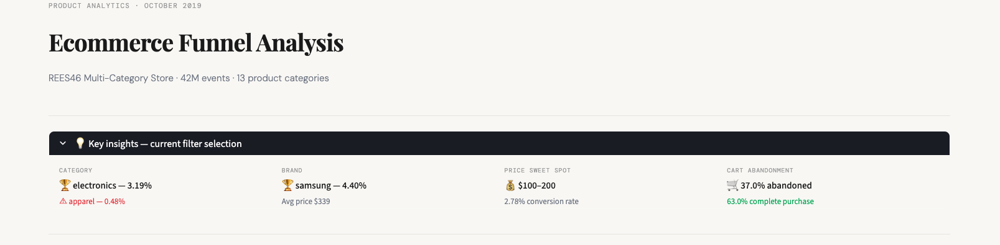

# Ecommerce Funnel Analysis



A senior-level product analytics project examining purchase funnel 
conversion across 42 million user events from a multi-category ecommerce 
store. Built to demonstrate end-to-end product analysis — from raw data 
to actionable recommendations — including an interactive Streamlit 
dashboard, cohort retention analysis, and warehouse-ready SQL.

---

## The question
Where are users dropping off in the purchase funnel, which categories 
and brands convert best, and what are the highest-leverage opportunities 
to improve conversion?

---

## Key findings

| Finding | Metric | Implication |
|---------|--------|-------------|
| Electronics dominates | 3.18% conversion, 56% of traffic | Benchmark all targets against electronics not the site average |
| Apparel funnel is broken | 0.48% conversion, ~0% cart rate | Highest priority for qualitative audit |
| Mid-to-premium sweet spot | 2%+ conversion from $100 to $2k | Trust gap at low end, consideration gap at $2k+ |
| Brand beats price | Apple 4.06% at $868 vs Samsung 4.30% at $334 | Surface top brands prominently in search |
| Purchases happen in session | 94% within 1 hour, median 2.4 mins | Friction removal beats retargeting every time |
| Repeat buyers are 3x more valuable | $926 vs $305 avg spend | Build retention programme targeting electronics buyers |
| Smartphones carry electronics | 3.63% on 127k views | Camera and clocks pages need urgent attention |

---

## Project structure
```
ecommerce-funnel-analysis/
├── data/                              # Raw CSV (not committed — 5GB)
├── notebooks/
│   └── 01_setup_exploration.ipynb    # Full analysis with markdown narrative
├── sql/
│   └── funnel_analysis.sql           # Warehouse-ready CTE queries
├── brief/
│   └── funnel_analysis_brief.md      # One-page product brief for PM/VP audience
├── dashboard.py                      # Interactive Streamlit dashboard
└── requirements.txt
```

---

## Running the dashboard
```bash
pip install -r requirements.txt
streamlit run dashboard.py
```

The dashboard loads 500k events on startup and the full 42M row dataset 
for cohort analysis. First load takes 2-3 minutes, then caches instantly.

---

## Dashboard features

- Sidebar filters by category and price range — all charts update live
- Dynamic insights panel showing best/worst performers for current selection
- Purchase funnel, category breakdown, brand conversion scatter
- Price elasticity by bucket, hourly conversion rate
- Cart abandonment by sub-category
- Full cohort retention heatmap (347k buyers, 31 days)

---

## Tools

- Python (pandas, matplotlib)
- Streamlit
- SQL (DuckDB compatible, BigQuery/Redshift syntax)
- Jupyter Notebook via VS Code

---

## Dataset

REES46 Multi-Category Store — October 2019  
Source: [Kaggle](https://www.kaggle.com/datasets/mkechinov/ecommerce-behavior-data-from-multi-category-store)  
42M+ events · 13 product categories · view, cart, purchase events